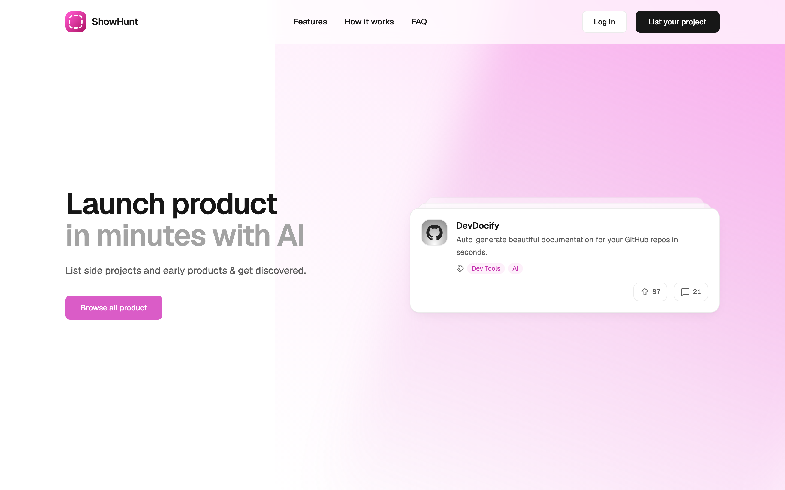
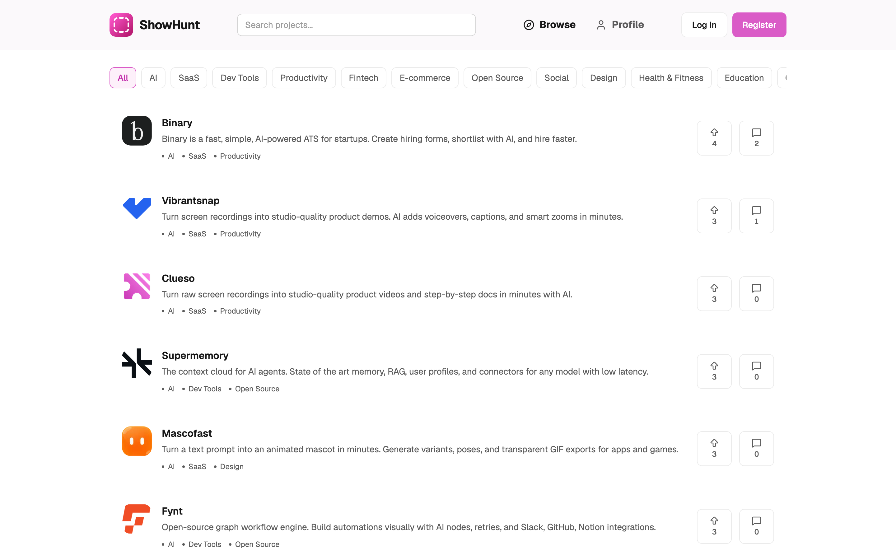
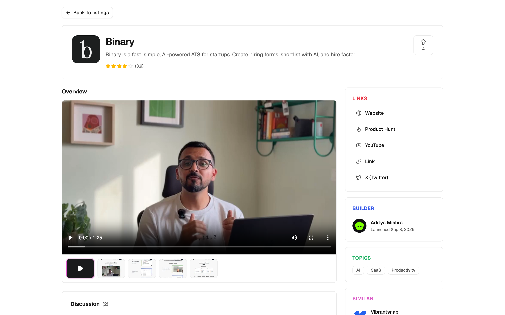
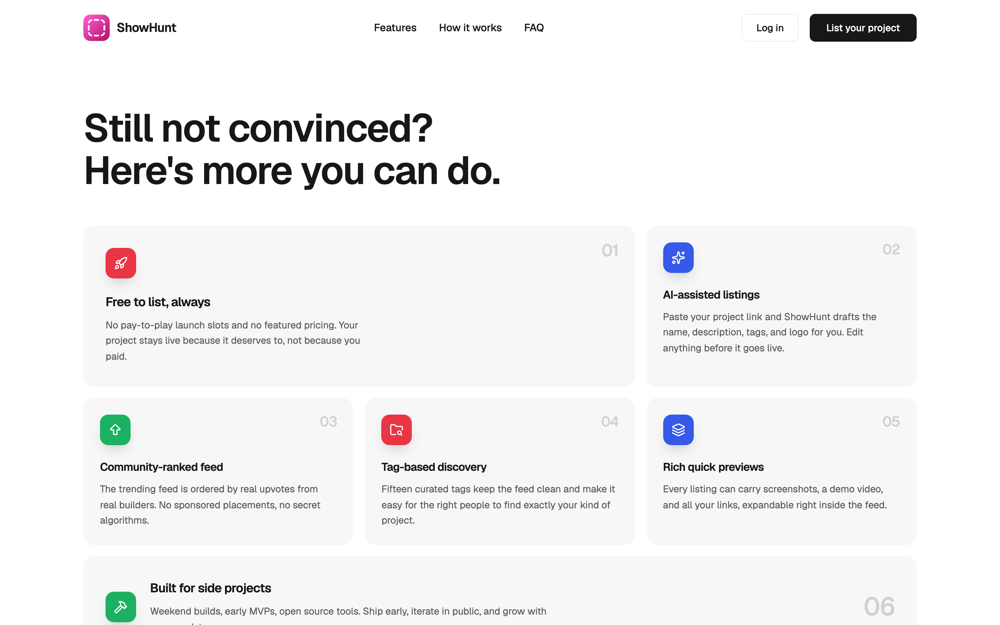
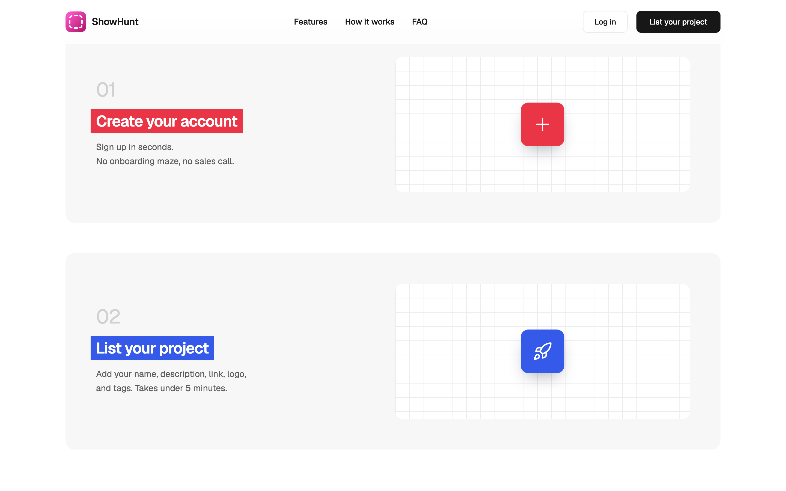
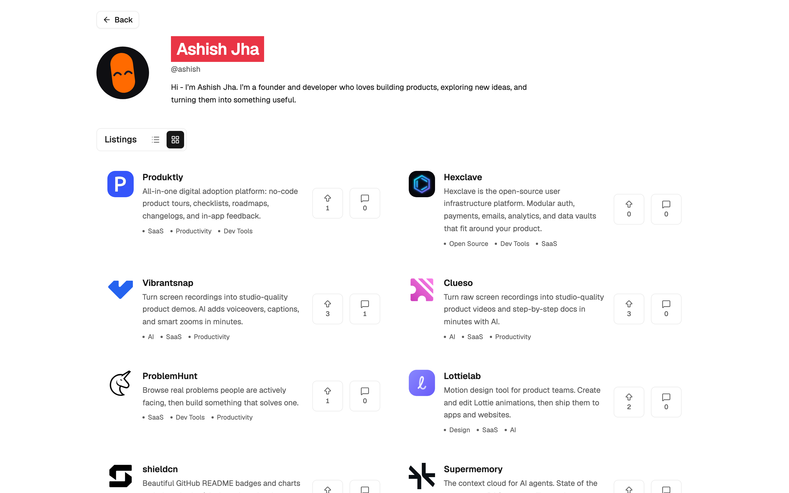
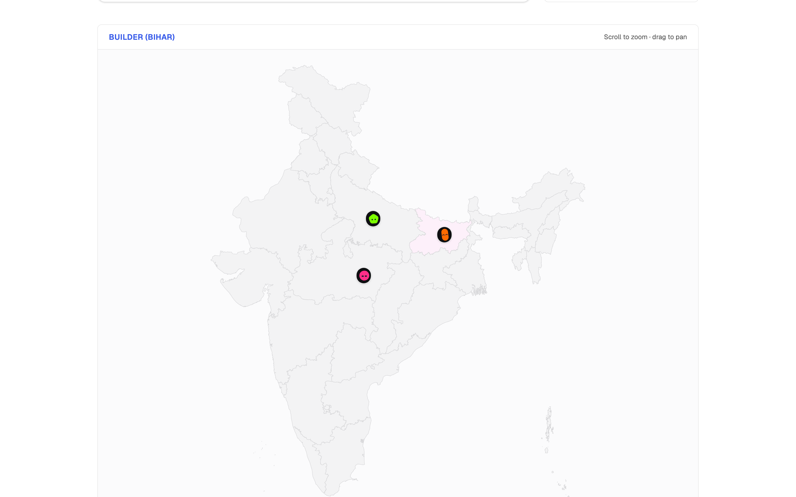

<p align="center">
  
</p>

<h1 align="center">ShowHunt</h1>

<p align="center">
  <strong>Showcase, discover, and upvote indie products.</strong><br />
  An always-on launch platform for side projects, MVPs, and early products — free to list, ranked by real builders, with AI-assisted listings and a voice-controlled companion.
</p>

<p align="center">
  <a href="http://showhunt.ashishjha.xyz">
    
  </a>
  &nbsp;
  <a href="https://github.com/ashishxjhaa/showhunt">
    
  </a>
  &nbsp;
  <a href="https://github.com/ashishxjhaa/showhunt">
    
  </a>
  &nbsp;
  <a href="https://github.com/ashishxjhaa/showhunt/issues">
    
  </a>
</p>

<p align="center">
  
  
  
  
  
  
  
  
</p>

<p align="center">
  <a href="http://showhunt.ashishjha.xyz"><strong>Live Demo</strong></a>
  ·
  <a href="#features"><strong>Features</strong></a>
  ·
  <a href="#getting-started"><strong>Getting Started</strong></a>
  ·
  <a href="#architecture"><strong>Architecture</strong></a>
  ·
  <a href="https://ashishjha.xyz/"><strong>Author</strong></a>
</p>

---

## Why ShowHunt?

Product Hunt is a launch-day lottery. ShowHunt is **always on** — list once, stay live, and climb the trending feed as builders discover and upvote you. No pay-to-play slots. No featured pricing. No credit card.

Paste your project link and AI drafts the name, description, tags, and logo. Ship in minutes, then grow with every update.

---

## Features

| | |
| :--- | :--- |
| **Free to list, always** | No launch slots, no featured pricing. Your project stays live because it deserves to. |
| **AI-assisted listings** | Paste a URL — DeepSeek drafts name, description, tags, and logo. Edit anything before you publish. |
| **Community-ranked feed** | Trending is ordered by real upvotes from signed-in builders. No sponsored placements. |
| **Tag-based discovery** | Fifteen curated tags keep the feed clean and make the right projects easy to find. |
| **Rich listing pages** | Screenshots, demo video, links, discussion, similar projects, and builder profiles. |
| **Public builder profiles** | Activity charts, project grids, and an interactive India builders map. |
| **Cody — voice companion** | Press **F2** to talk. Navigate, search, fill forms, and answer FAQ via Pipecat + Sarvam + DeepSeek. |
| **Google + email auth** | Sign up fast with Google OAuth or email/password. |

---

## Screenshots

<p align="center">
  
  <em>Landing — launch products in minutes with AI</em>
</p>

<p align="center">
  
  <em>Browse — search, filter by tag, upvote, and discuss</em>
</p>

<p align="center">
  
  <em>Listing detail — media, links, builder, topics, and discussion</em>
</p>

<table>
  <tr>
    <td width="50%">
      
      <p align="center"><em>Features</em></p>
    </td>
    <td width="50%">
      
      <p align="center"><em>How it works</em></p>
    </td>
  </tr>
  <tr>
    <td width="50%">
      
      <p align="center"><em>Public builder profile</em></p>
    </td>
    <td width="50%">
      
      <p align="center"><em>India builders map</em></p>
    </td>
  </tr>
</table>

---

## Tech Stack

| Layer | Stack |
| :--- | :--- |
| **Web** | Next.js 16 (App Router), React 19, Tailwind CSS 4, shadcn/ui, TanStack Query, Motion |
| **API** | Bun + Express 5, Zod validation, JWT cookies, Google OAuth |
| **Data** | Prisma 7, PostgreSQL (Neon serverless or local `pg`) |
| **Storage** | AWS S3 (presigned uploads for logos, photos, videos) |
| **AI** | DeepSeek (listing enrichment + voice LLM) |
| **Voice** | Pipecat, Sarvam STT/TTS, Silero VAD, WebRTC |
| **Monorepo** | Turborepo + Bun workspaces |

---

## Architecture

```text
showhunt/
├── apps/
│   ├── web/       # Next.js frontend  → :3000
│   ├── server/    # Bun + Express API → :4000  (/api/v1/*)
│   └── voice/     # Pipecat voice agent → :7860
├── docs/images/   # README / marketing screenshots
├── docker-compose.yml
└── package.json
```

| Service | Role |
| :--- | :--- |
| `apps/web` | Marketing site, auth, listings feed, profiles, Cody client |
| `apps/server` | REST API, Prisma, auth, S3 uploads, DeepSeek enrichment |
| `apps/voice` | Realtime voice agent over WebRTC (Sarvam + DeepSeek) |

---

## Getting Started

### Prerequisites

- [Bun](https://bun.sh) `>= 1.3`
- Node.js `>= 20`
- PostgreSQL (local, Docker, or [Neon](https://neon.tech))
- [uv](https://docs.astral.sh/uv/) (for the voice worker)
- Optional: AWS S3, Google OAuth, DeepSeek, Sarvam API keys

### Install

```bash
git clone https://github.com/ashishxjhaa/showhunt.git
cd showhunt
bun install

# Voice worker deps (once)
cd apps/voice && uv sync && cd ../..
```

### Environment

Copy `.env.example` into each app:

```bash
cp .env.example apps/web/.env
cp .env.example apps/server/.env
cp apps/voice/.env.example apps/voice/.env
```

Fill in the values for the services you need (see [Environment Variables](#environment-variables)).

### Database

```bash
bun run db:migrate
```

### Run locally

```bash
# Web + API (Turborepo)
bun run dev

# Voice agent (separate terminal)
bun run voice:dev
```

Or individually:

```bash
bun run web:dev      # http://localhost:3000
bun run server:dev   # http://localhost:4000
bun run voice:dev    # http://localhost:7860
```

### Docker

```bash
docker compose up --build
```

| Service | URL |
| :--- | :--- |
| Web | http://localhost:3000 |
| API | http://localhost:4000 |
| Voice | http://localhost:7860 |

---

## Environment Variables

Shared / server essentials from `.env.example`:

| Variable | Where | Purpose |
| :--- | :--- | :--- |
| `DATABASE_URL` | server | Postgres connection string |
| `DATABASE_ADAPTER` | server | `neon` (default) or `pg` for local/Docker |
| `JWT_SECRET` | server | Auth token signing |
| `FRONTEND_URL` | server / voice | CORS + cookie origin (`http://localhost:3000`) |
| `NEXT_PUBLIC_API_URL` | web | API base URL |
| `NEXT_PUBLIC_VOICE_URL` | web | Voice worker URL |
| `NEXT_PUBLIC_VOICE_ICE_SERVERS` | web | STUN/TURN JSON (must match voice `ICE_SERVERS`) |
| `ICE_SERVERS` | voice | STUN/TURN JSON for Railway/production WebRTC |
| `NEXT_PUBLIC_GOOGLE_CLIENT_ID` | web | Google Sign-In |
| `GOOGLE_CLIENT_ID` | server | Google token verification |
| `DEEPSEEK_API_KEY` | server / voice | Listing enrichment + voice LLM |
| `SARVAM_API_KEY` | voice | STT / TTS |
| `AWS_ACCESS_KEY_ID` / `AWS_SECRET_ACCESS_KEY` / `AWS_REGION` / `S3_BUCKET_NAME` | server | Media uploads |

Voice-only minimum: `SARVAM_API_KEY`, `DEEPSEEK_API_KEY`, and `NEXT_PUBLIC_VOICE_URL=http://localhost:7860` in `apps/web/.env`.

**Production voice (Railway):** `/api/offer` alone is not enough. WebRTC media needs a **TURN** server because Railway peers sit behind NAT. Set the **same** ICE JSON on Railway (`ICE_SERVERS`) and Vercel (`NEXT_PUBLIC_VOICE_ICE_SERVERS`), then redeploy both. Free TURN: [Metered Open Relay](https://www.metered.ca/tools/openrelay/). Also set `FRONTEND_URL` on Railway to your Vercel origin.

---

## Voice Agent (Cody)

Cody sits bottom-right on the app. Press **F2** to start (mic + notify sound). Talk freely — VAD handles turns. Press **Escape** to hang up.

Cody can:

- Navigate routes and smooth-scroll landing sections
- Search listings and open builder profiles
- Fill auth, listing, and profile forms
- Answer ShowHunt FAQ

Tools are allowlisted — no arbitrary DOM clicks.

---

## Scripts

| Command | Description |
| :--- | :--- |
| `bun run dev` | Start web + server via Turborepo |
| `bun run web:dev` | Next.js only |
| `bun run server:dev` | API only |
| `bun run voice:dev` | Voice worker |
| `bun run build` | Build all packages |
| `bun run lint` | Lint all packages |
| `bun run typecheck` | Typecheck all packages |
| `bun run db:migrate` | Run Prisma migrations |

---

## Author

**Ashish Jha**

<p>
  <a href="https://ashishjha.xyz/">
    
  </a>
  &nbsp;
  <a href="https://github.com/ashishxjhaa">
    
  </a>
  &nbsp;
  <a href="https://x.com/ashishxjha">
    
  </a>
  &nbsp;
  <a href="https://www.linkedin.com/in/ashishxjha/">
    
  </a>
</p>

---

<p align="center">
  <a href="http://showhunt.ashishjha.xyz">
    
  </a>
</p>
