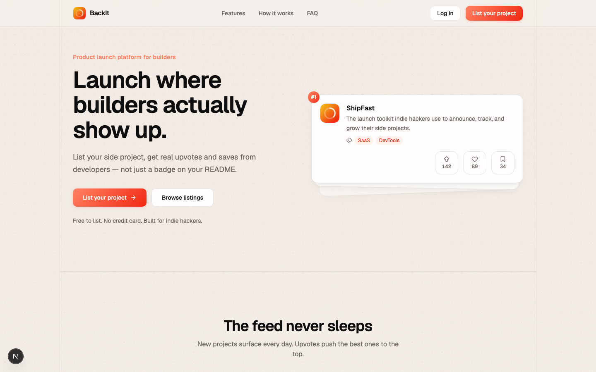
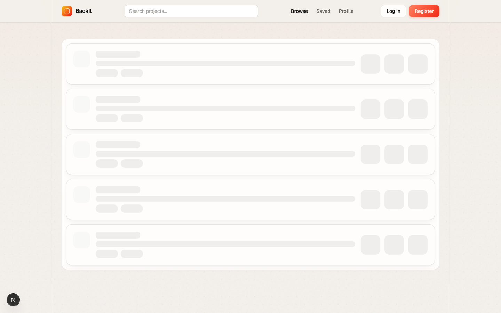
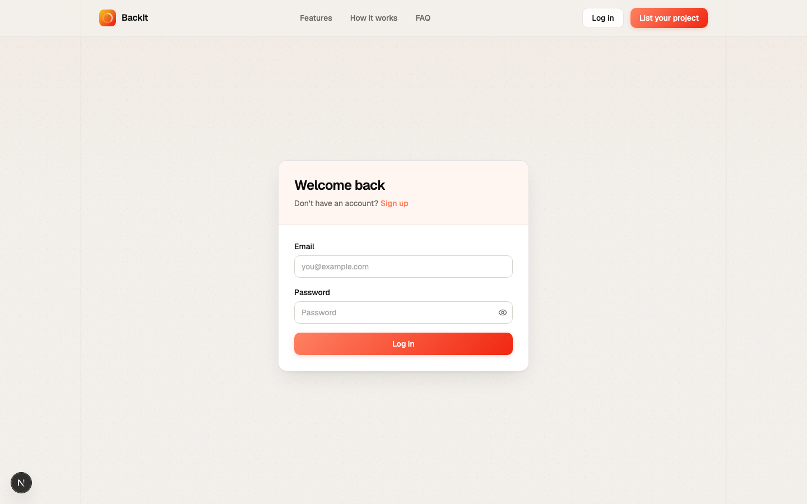
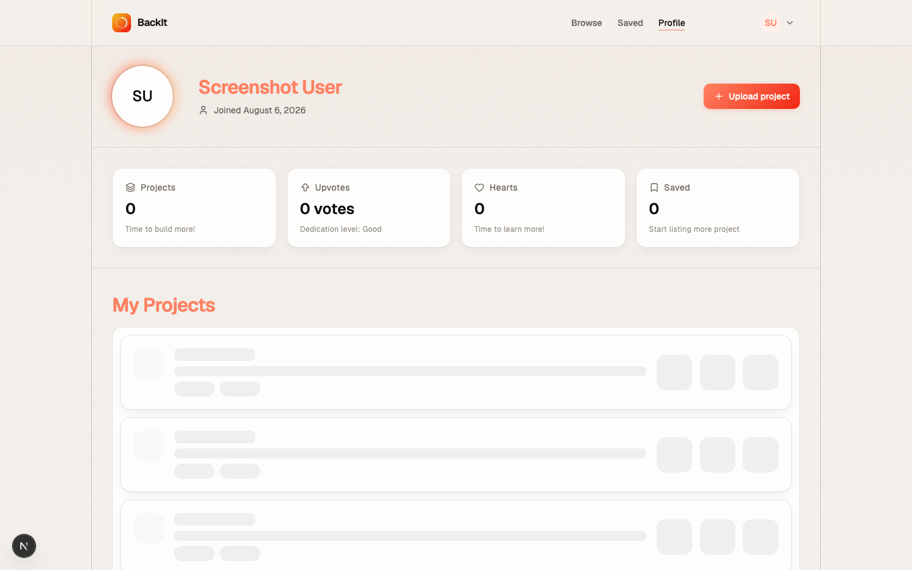
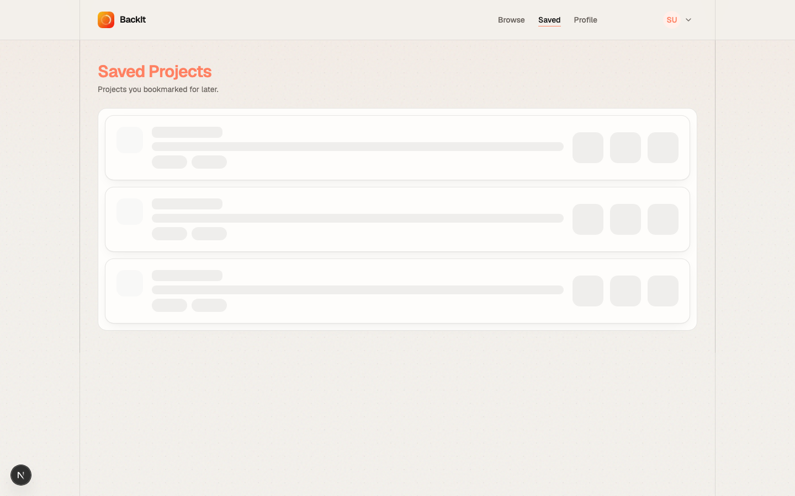
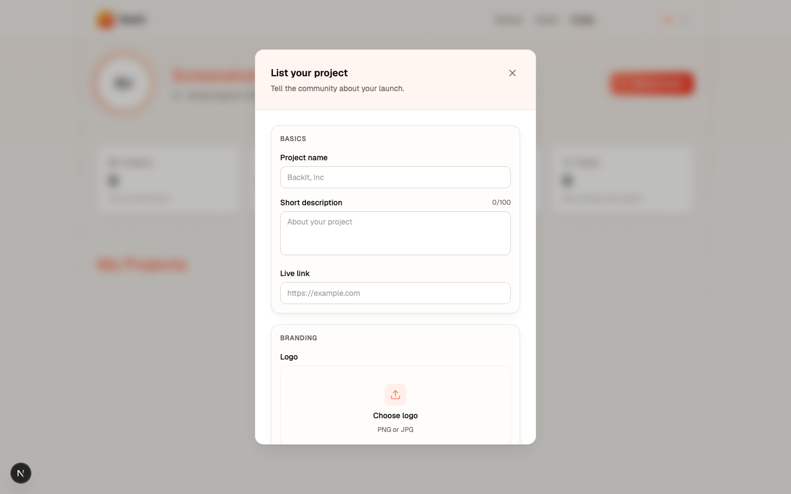

<div align="center">


# BackIt

**Launch your product. Get discovered.**

A product launch platform where developers and founders list projects, get discovered, and receive community engagement through upvotes, hearts, and saves.

[](https://back-it-two.vercel.app)
[](https://github.com/ashishxjhaa/BackIt/stargazers)
[](https://github.com/ashishxjhaa/BackIt/network/members)
[](https://github.com/ashishxjhaa/BackIt/issues)

[Live Demo](https://back-it-two.vercel.app) · [Report Bug](https://github.com/ashishxjhaa/BackIt/issues) · [Request Feature](https://github.com/ashishxjhaa/BackIt/issues)

</div>

---

## Preview

<table>
  <tr>
    <td align="center"><strong>Landing</strong></td>
    <td align="center"><strong>Listings</strong></td>
    <td align="center"><strong>Sign In</strong></td>
  </tr>
  <tr>
    <td></td>
    <td></td>
    <td></td>
  </tr>
  <tr>
    <td align="center"><strong>Profile</strong></td>
    <td align="center"><strong>Saved</strong></td>
    <td align="center"><strong>Upload project</strong></td>
  </tr>
  <tr>
    <td></td>
    <td></td>
    <td></td>
  </tr>
</table>

## Features

- **Project listings** — browse a trending feed and search by name, description, tags, or maker
- **Upload projects** — list with a name, description, live link, logo, and up to 3 tags
- **Engagement** — upvote, heart, and save projects with optimistic UI updates
- **Trending ranking** — projects ranked by `upvotes × 3 + hearts × 2 + saves`
- **User profiles** — dashboard with engagement stats and your listed projects
- **Saved projects** — bookmark projects and revisit them later
- **Authentication** — JWT in httpOnly cookies with bcrypt-hashed passwords
- **Paper-style UI** — Geist typography, coral accent palette, and grid-frame layout across landing, auth, and dashboard

## Tech Stack

Built with Next.js 16 App Router, React 19, TypeScript, Tailwind CSS 4, Geist, Prisma 7, PostgreSQL (Neon), TanStack Query, shadcn/ui, Zod, and Motion.

<div align="center">


</div>

## Getting Started

### Prerequisites

- [Bun](https://bun.sh/) (recommended) or Node.js 20+
- PostgreSQL database ([Neon](https://neon.tech/) recommended)

### Installation

```bash
git clone https://github.com/ashishxjhaa/BackIt.git
cd BackIt
bun install
```

Create a `.env` file in the project root (see [Environment Variables](#environment-variables)):

```bash
cp .env.example .env
```

Set up the database and start the dev server:

```bash
bunx prisma db push
bun run dev
```

Open [http://localhost:3000](http://localhost:3000) in your browser.

> **Note:** `npm`, `yarn`, and `pnpm` also work — replace `bun` / `bunx` with your package manager of choice.

## Environment Variables

| Variable | Required | Description |
|----------|----------|-------------|
| `DATABASE_URL` | Yes | PostgreSQL connection string (Neon recommended) |
| `JWT_SECRET` | Yes | Secret for signing and verifying JWT tokens |
| `SCREENSHOT_EMAIL` | No | Test account email for `bun run screenshots` |
| `SCREENSHOT_PASSWORD` | No | Test account password for `bun run screenshots` |
| `SCREENSHOT_BASE_URL` | No | Dev server URL for screenshots (default: `http://localhost:3000`) |

## Scripts

| Command | Description |
|---------|-------------|
| `bun run dev` | Start the development server on port 3000 |
| `bun run build` | Generate Prisma client and create a production build |
| `bun run start` | Start the production server |
| `bun run lint` | Run ESLint |
| `bun run screenshots` | Capture README preview screenshots (dev server must be running) |

### Updating screenshots

```bash
# Add SCREENSHOT_EMAIL and SCREENSHOT_PASSWORD to .env, then:
bun run dev
bun run screenshots
```

If your dev server runs on a different port, set `SCREENSHOT_BASE_URL` (e.g. `http://localhost:3001`).

## Project Structure

```
BackIt/
├── app/                    # Next.js App Router pages and API routes
│   ├── (Authentication)/   # Sign in and sign up
│   ├── (Dashboard)/        # Listings, profile, and saved pages
│   └── api/                # REST API endpoints
├── components/             # React components
│   ├── landing/            # Landing page sections
│   ├── AppShell.tsx        # Dashboard layout + grid rails
│   ├── AppNavbar.tsx       # Unified dashboard nav
│   ├── AuthShell.tsx       # Auth page layout
│   └── ui/                 # shadcn/ui primitives
├── docs/screenshots/       # README preview images
├── lib/                    # Auth, Prisma, ranking, React Query hooks
├── prisma/                 # Schema and migrations
├── public/                 # Static assets (logo, images)
├── scripts/                # Utility scripts (screenshot capture)
└── middleware.ts           # JWT auth middleware
```

## Routes

| Route | Auth | Description |
|-------|------|-------------|
| `/` | Public | Landing page |
| `/listings` | Public browse | Trending project feed |
| `/profile` | Required | User profile and project upload |
| `/saved` | Required | Bookmarked projects |
| `/signin` | Public | Sign in |
| `/signup` | Public | Create an account |

## Trending Algorithm

Projects in the listings feed are ranked by engagement score:

```
score = upvotes × 3 + hearts × 2 + saves
```

Ties are broken by creation date (newest first). See [`lib/ranking.ts`](lib/ranking.ts).

## Deployment

BackIt is deployed on [Vercel](https://vercel.com/). To deploy your own instance:

1. Push the repo to GitHub
2. Import the project in Vercel
3. Set `DATABASE_URL` and `JWT_SECRET` environment variables
4. Run `prisma db push` against your production database

## Author

**Ashish** — [GitHub](https://github.com/ashishxjhaa)

---

